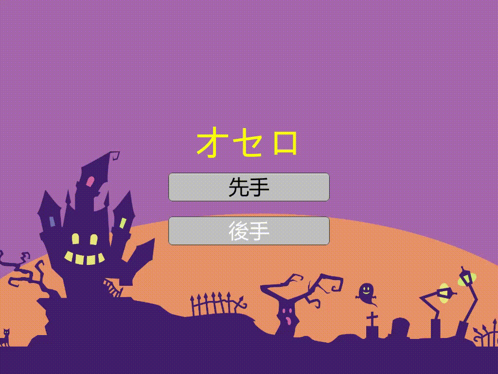

# リバーシのプログラム
## 実行方法
Environmentフォルダの中にある`Reversi.exe`を実行するだけ  

## 操作方法
Rキー長押しでリザルト画面に飛ぶ  
Tキー長押しでタイトル画面に戻る  
ゲーム中にEscキーを押すことでタイトルに戻ることもできる  

## 実行例
  

## フォルダ・ファイルの説明  
- Environment: 実行ファイルReversi.exeと実行に必要なファイルを置いている  
- KosenFestival: 高専祭用のフォルダ  
- Unity: Unityのプロジェクトを置いている  
- VisualStudio: dllファイル(c++で作ったソースコードをdllファイルで一つにまとめてUnityから使えるようにする)を作ったときのVisualStudioでのフォルダの階層と、dllファイルを作る用の中身。  
- c++: コマンドプロンプトで動かせるオセロ  
	- Interface.cpp: main関数がある。流れを管理する。  
	- Makefile: 複数のファイルをコンパイル実行する。  
	- Player.cpp: 次の一手を考えてくれる。プレイヤーは「Random」、「Human」、「AlphaBeta」がある。  
	- Player.h: Player.cppのヘッダーファイル。  
	- ReversiBoard.cpp: ボードの表示や初期化、石を置いた時の処理などをしてくれる。  
	- ReversiBoard.h: ReversiBoard.cppのヘッダーファイル  
	- header.h: 複数のファイルで共通に使うヘッダーファイル  
